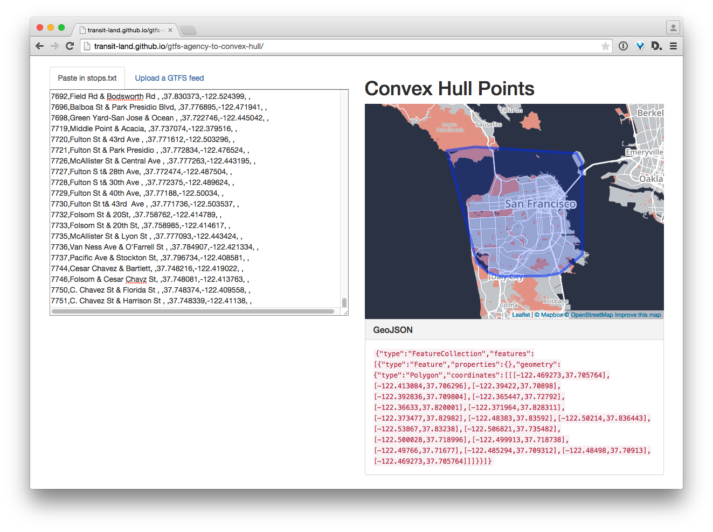
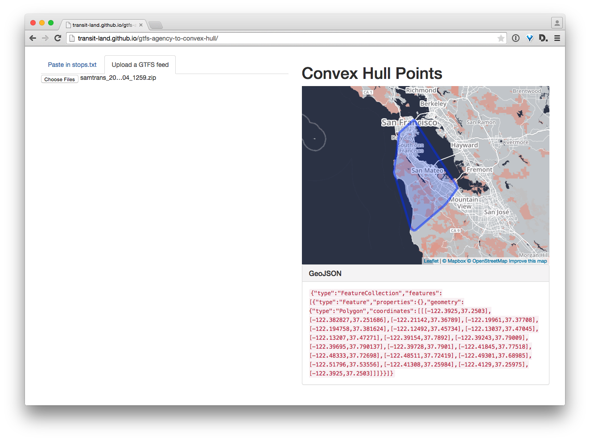

# gtfs-agency-to-convex-hull

**What?** A little one page JavaScript application that takes the `stops.txt` file from a [GTFS](https://developers.google.com/transit/gtfs/) feed ***or*** a direct upload of the entire GTFS zip file, computes a [convex hull](http://en.wikipedia.org/wiki/Convex_hull) around all the stop locations, outputs that polygon as GeoJSON, and plots it on a map.

**Why?**: If you don't have boundaries for a transit agencies service region, it's helpful to be able to easily approximate that based on where their stops are located.

**How?** Go to http://transitland.github.io/gtfs-agency-to-convex-hull/ and paste in the contents of a `stops.txt` file from a GTFS feed ***or*** upload a local copy of a GTFS feed zip archive.

**Enough questions. Show me examples, please.**

